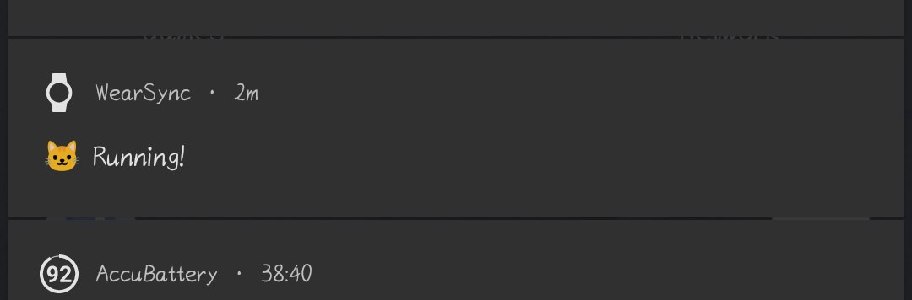

# WearSync

Sync BLE smart watch device data (heart rate, battery, etc.) to an InfluxDB server.

### Demo

### Setup

1. Setup a InfluxDB Server (You can do it with docker-compose, it's really easy!)
2. Type in your influxDB connection detials in the app

 

3. Scan & Connect to your device
4. Watch everything work

 

### Background Service

For the background service to work, a notification is displayed. To ensure the background service stays alive, please also [disable battery optimizations](https://user-images.githubusercontent.com/22280294/214209600-387f776a-0e37-4ecc-8bbd-03aa17d335db.png).

 

